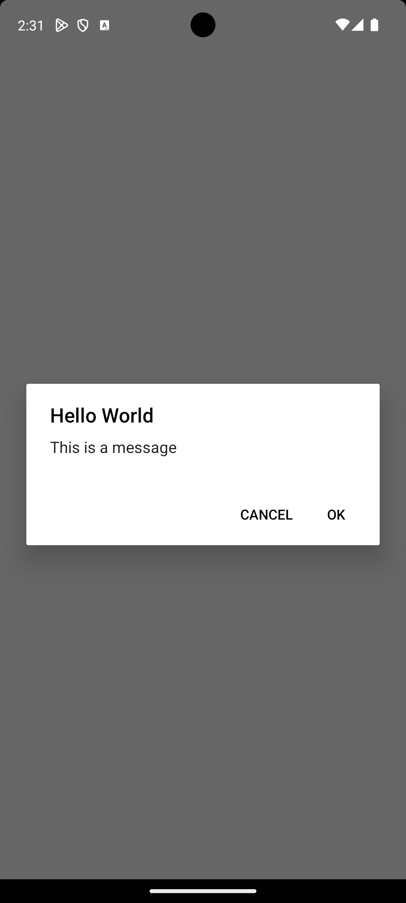
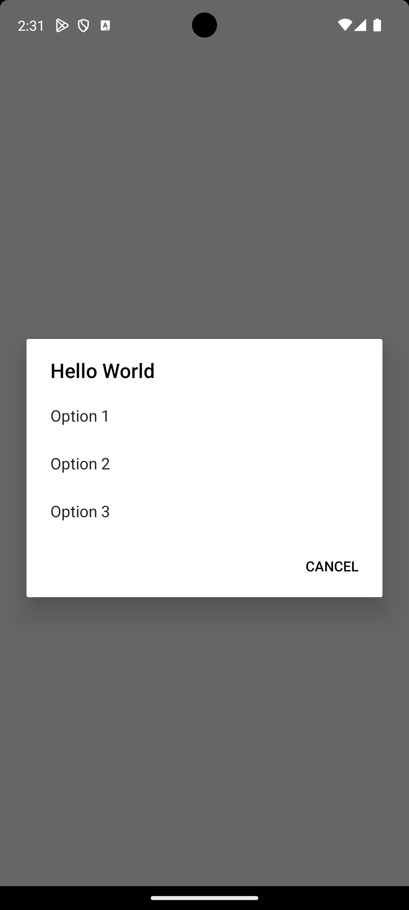
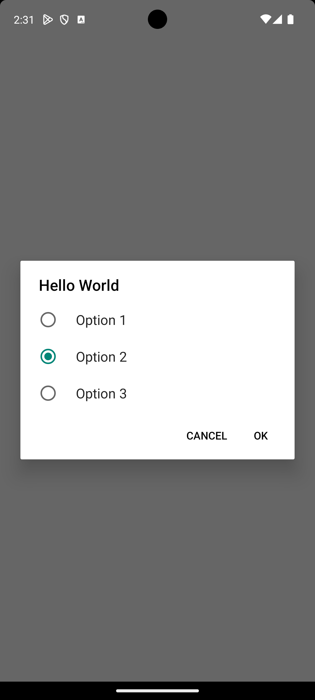
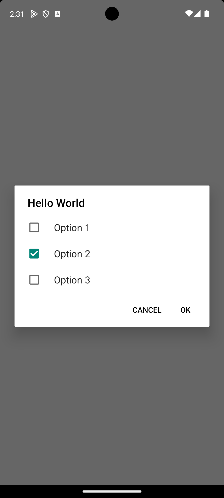

# expo-dialogs

Create native Android dialogs with Expo. This library is a wrapper around the native Android dialogs. Only a few dialog types are supported at the moment.

## Installation

```bash
npx expo install expo-dialogs
```

## Usage


### Show dialog

This Dialog is quite similair to the Alert.alert() method in React Native.

```javascript
import * as ExpoDialogs from "expo-dialogs";

const result = await ExpoDialogs.showDialog({
  title: "Hello World",
  message: "This is a message",
  positiveButtonText: "OK",
  negativeButtonText: "Cancel",
});

// result is true if the positive button was clicked, false if the negative button was clicked
console.log("Dialog result:", result);
```




### Show selection dialog

```javascript
import * as ExpoDialogs from "expo-dialogs";

const result = await ExpoDialogs.showSelectionDialog({
  options: ["Option 1", "Option 2", "Option 3"],
  title: "Hello World",
  negativeButtonText: "Cancel",
});

console.log("Selected index:", result);
```



### Show radio button dialog

```javascript
import * as ExpoDialogs from "expo-dialogs";

const result = await ExpoDialogs.showRadioButtonDialog({
  options: ["Option 1", "Option 2", "Option 3"],
  title: "Hello World",
  selectedIndex: 1,
  negativeButtonText: "Cancel",
});

console.log("Selected index:", result);
```



### Show checkbox dialog

```javascript
import * as ExpoDialogs from "expo-dialogs";

const result = await ExpoDialogs.showCheckboxDialog({
  options: ["Option 1", "Option 2", "Option 3"],
  title: "Hello World",
  selectedIndices: [1],
  negativeButtonText: "Cancel",
});

console.log(`Selected indices: ${JSON.stringify(result)}`);
```

